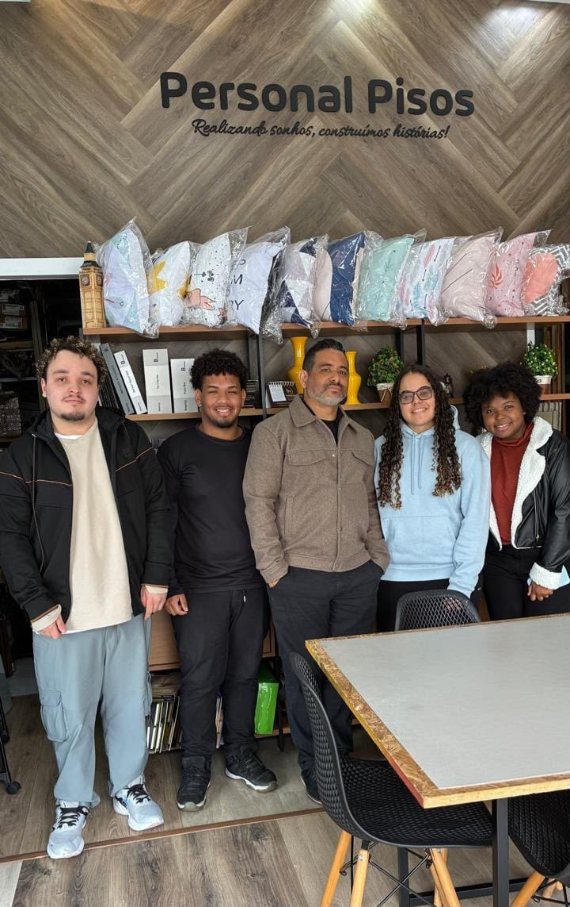

# Personal Pisos

## Integrantes do grupo

| Nome completo                    | RGM      | Usuário no GitHub                                                |
| -------------------------------- | -------- | ---------------------------------------------------------------- |
| Ana Beatriz Morais Lessa         | 48553867 | [@anbmorais001-maker](https://github.com/anbmorais001-maker)     |
| Guilherme de Aquino Campos       | 48183989 | [@gaquinocampos](https://github.com/gaquinocampos)               |
| Jhenifer Rosa Cambell            | 47794992 | [@jhenifercambell-hash](https://github.com/jhenifercambell-hash) |
| Julia Lafaelly Frazão Nunes      | 48127507 | [@JuliaLafaelly](https://github.com/JuliaLafaelly)               |
| Marcos Murilo Fernandes da Silva | 48159786 | [@murilomarcosfer-beep](https://github.com/murilomarcosfer-beep) |

## Website hospedado

O website está hospedado no GitHub Pages e pode ser acessado pelo link:

[https://julialafaelly.github.io/Site_Personal_Pisos/]

O projeto foi configurado para hospedagem pública utilizando o branch `main` do repositório.

## Organização escolhida

A organização escolhida para o desenvolvimento do projeto foi a **Personal Pisos e Carpetes**, empresa que atua no segmento de pisos, carpetes, tapetes, persianas, papéis de parede, rodapés e decoração de interiores.

A escolha da empresa ocorreu por ser uma organização real, com atuação no mercado de decoração e revestimentos. O website foi desenvolvido para apresentar a empresa, seus produtos, serviços, formas de contato e possibilidades de orçamento para os clientes.

## Estrutura do website

O projeto foi desenvolvido com páginas HTML interligadas por meio de menus de navegação.

As páginas principais são:

- Página inicial
- Página de contato
- Página de orçamento
- Página sobre a empresa
- Página de pisos laminados
- Página de pisos vinílicos
- Página de carpetes e tapetes
- Página de papéis de parede
- Página de persianas
- Página de rodapés

Cada página apresenta informações relacionadas à organização e possui links para facilitar a navegação entre as demais seções do website.

## Estrutura semântica

Todas as páginas foram desenvolvidas utilizando HTML5 semântico. Foram utilizados elementos como:

- `header`, para o cabeçalho;
- `nav`, para os menus de navegação;
- `main`, para o conteúdo principal;
- `section`, para organizar os blocos de conteúdo;
- `article`, para conteúdos independentes;
- `footer`, para o rodapé;
- `form`, `label`, `fieldset` e `legend`, para a estrutura dos formulários;
- `address`, para as informações de localização e contato.

A utilização desses elementos contribui para melhorar a organização do código, a acessibilidade e a interpretação do conteúdo por navegadores e mecanismos de busca.

## Formulário de contato

O website possui formulários nas páginas de contato e orçamento. Foram utilizados recursos nativos de validação do HTML5, incluindo:

- `required`, para definir campos obrigatórios;
- `type="email"`, para validar endereços de e-mail;
- `type="tel"`, para campos de telefone;
- `pattern`, para definir os formatos aceitos de telefone e CPF;
- `minlength`, para estabelecer a quantidade mínima de caracteres;
- `maxlength`, para limitar o tamanho das informações preenchidas;
- `autocomplete`, para auxiliar o preenchimento dos dados pelo usuário.

Os campos de telefone e CPF possuem máscaras para facilitar a digitação no formato adequado. A validação é realizada pelo próprio navegador, sem a necessidade de bibliotecas externas.

## Recursos de áudio e vídeo

O projeto também conta com recursos multimídia para complementar a apresentação da organização e dos seus serviços.

Foi utilizado recurso de vídeo na página institucional da empresa, apresentando informações relacionadas ao trabalho realizado e aos ambientes decorados. Também foi incluído um áudio instrumental aconchegante e original, sem uso de obra de terceiros, na página Sobre.

A inclusão de áudio e vídeo torna o website mais informativo e permite apresentar os serviços de forma mais dinâmica.

## Validação no W3C

Todos os arquivos HTML foram submetidos ao W3C Nu HTML Checker.

Após as correções realizadas na estrutura do código, as páginas foram validadas e não apresentaram erros relevantes no W3C Validator.

**Validador utilizado:** [W3C Nu HTML Checker](https://validator.w3.org/nu/)

## Contato com o responsável pela organização

O contato com o responsável pela Personal Pisos e Carpetes foi realizado por meio de:

- **Modalidade do contato:** Presencial
- **Data:** 22/08/2026
- **Responsável entrevistado:** Jonatan Nunes/Grazielle Nunes (Dono da Empresa)
- **Participantes do grupo:** Guilheme Campos, Jhenifer Rosa, Julia Lafaelly e Marcos Murilo

Durante o contato, foram coletadas informações sobre a história da empresa, os principais produtos e serviços oferecidos, o público atendido, os diferenciais da organização e as necessidades que o website deveria apresentar.

A conversa também ajudou o grupo a compreender melhor a identidade da empresa e a organizar os conteúdos das páginas desenvolvidas.

## Comprovação do contato

**Imagem da comprovação:**

## Conclusão

A primeira etapa do projeto permitiu ao grupo desenvolver a base estrutural de um website utilizando HTML5, sem depender de estilização visual ou recursos avançados de CSS.

Durante o desenvolvimento, aprendemos a organizar páginas com elementos semânticos, criar menus de navegação, estruturar formulários, utilizar validações nativas do HTML5 e inserir recursos multimídia de áudio e vídeo.

Também compreendemos a importância de desenvolver um projeto baseado em uma organização real, pois o contato com o responsável contribuiu para tornar o conteúdo mais coerente com as características e necessidades da empresa.

A validação no W3C ajudou o grupo a identificar e corrigir problemas no código, reforçando a importância de seguir os padrões da web e utilizar uma estrutura HTML organizada, acessível e válida.
